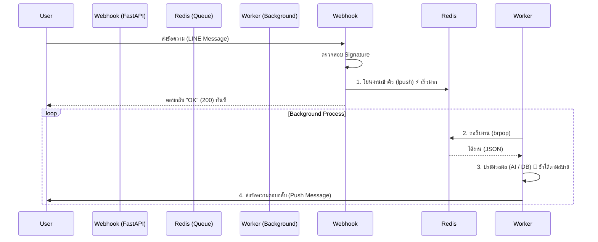

# ระบบคิวและการแก้ปัญหา Blocking I/O (Queue & Blocking I/O Guide)

เอกสารนี้รวบรวมแนวทางการออกแบบระบบคิว (Queue) ด้วย Redis และวิเคราะห์ปัญหา "คอขวด" ที่เกิดจากการเรียก Database แบบผิดวิธีใน FastAPI พร้อมวิธีแก้ไข เพื่อให้นำไปปรับใช้ในโปรเจกต์อื่นได้

---

## 1. ผังการทำงานของระบบคิว (Queue Architecture)

เราใช้โมเดล **Producer-Consumer** เพื่อแยกการรับ Request (ที่ต้องเร็ว) ออกจากการประมวลผลหนักๆ (AI/Database)



### ข้อดีของระบบนี้
*   **High Availability**: Webhook ไม่ล่มง่ายๆ เพราะไม่ต้องรอ AI คิดให้เสร็จ
*   **Scalability**: ถ้างานล้นคิว สามารถเพิ่ม Worker (รัน `worker.py` หลายๆ ตัว) มาช่วยกันรุมทำงานได้ทันที

---

## 2. โค้ดส่วน Webhook (Producer) และปัญหา Blocking I/O

นี่คือส่วนที่มีปัญหาในโปรเจกต์ปัจจุบัน และเป็น **Case Study** ที่ดีสำหรับการทำ Web Service

### ❌ ปัญหา: การเรียก Sync DB ใน Async Function

ใน **FastAPI**, ถ้าคุณประกาศฟังก์ชันเป็น `async def`, Python จะรันโค้ดนั้นใน **Event Loop** เดียวกันทั้งหมด
*   **กฎเหล็ก**: ห้ามมีโค้ดที่ "รอ" (Blocking) นานๆ ใน `async def` โดยไม่มี `await`
*   **ความผิดพลาด**: การเรียก `sqlite3` หรือ Database Driver ทั่วไปที่เป็น Synchronous (รอ I/O นาน)

```python
# ตัวอย่างโค้ดที่มีปัญหา (Anti-Pattern)
@app.post("/webhook")
async def handle_webhook(request: Request): # 1. ประกาศเป็น Async
    # ... รับ Request ...

    # 2. ❌ เรียก Database แบบ Sync (Blocking) ตรงๆ
    # จังหวะนี้ Event Loop จะ "หยุดนิ่ง" (Freeze) 
    # Request ของคนอื่นที่เข้ามาช่วงนี้จะ "ค้าง" จนกว่าบรรทัดนี้จะเสร็จ
    user_persona = get_user_persona(user_id) 
    
    # 3. โยนงานเข้า Redis
    redis_client.lpush(QUEUE_KEY, json.dumps(job))
```

### ✅ วิธีแก้ไข: ใช้ `run_in_threadpool`

วิธีแก้ที่ง่ายที่สุดโดยไม่ต้องรื้อ Database Driver ใหม่คือการสั่งให้ FastAPI เอาโค้ดส่วนที่ช้าๆ ไปรันใน **Thread** แยกต่างหาก เพื่อไม่ให้ขวาง Event Loop หลัก

```python
from fastapi.concurrency import run_in_threadpool # 1. import ตัวช่วย

@app.post("/webhook")
async def handle_webhook(request: Request):
    # ...
    
    # 2. ✅ เรียกใช้ผ่าน run_in_threadpool พร้อม await
    # FastAPI จะโยน function นี้ไปรันใน Thread อื่น แล้วค่อยกลับมาเมื่อเสร็จ
    user_persona = await run_in_threadpool(get_user_persona, user_id)
    
    # ...
```

---

## 3. โค้ดส่วน Worker (Consumer)

ส่วน Worker ไม่มีปัญหาเรื่อง Blocking รุนแรงเท่า Webhook เพราะมันรันแยก Process กัน แต่มีจุดที่ต้องระวังในการดึงงาน

```python
import redis
import json

def main():
    # เชื่อมต่อ Redis
    r = redis.Redis(host='localhost', port=6379, db=0)
    
    while True:
        # 1. ⚠️ ใช้ brpop แทน pop ธรรมดา
        # brpop (Blocking Pop) จะ "รอ" อยู่ตรงนี้จนกว่าจะมีของมา
        # ทำให้ไม่เปลือง CPU วนลูปเช็คของเปล่าๆ (Busy Waiting)
        # timeout=0 คือรอตลอดไป
        queue_name, data_json = r.brpop("my_queue_key", timeout=0)
        
        # 2. แปลงข้อมูลและทำงาน
        data = json.loads(data_json)
        process_task(data)
```

## สรุปสำหรับการนำไปใช้ต่อ

1. ใช้อาร์กิเทกเจอร์ **Producer (FastAPI) -> Redis -> Consumer (Worker)** เสมอสำหรับงานที่ใช้เวลาเกิน 1-2 วินาที (เช่น AI, Image Processing)
2. ใน **FastAPI (`async def`)**, ห้ามเรียก Database หรือ I/O แบบ Sync ตรงๆ
    *   ถ้าเลี่ยงไม่ได้ ให้ใช้ `await run_in_threadpool(func, args)`
    *   หรือเปลี่ยนไปใช้ Library แบบ Async (เช่น `motor` สำหรับ MongoDB, `aiosqlite` สำหรับ SQLite)
3. ใช้ `brpop` ใน Worker เพื่อประหยัด CPU
