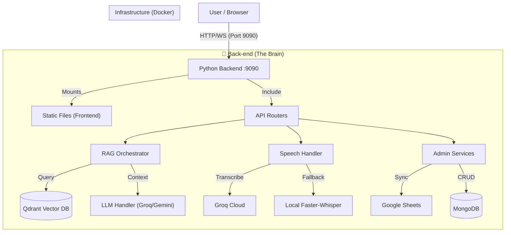

# 📂 โครงสร้างโปรเจกต์ (Project Structure) - Pure Python Edition

เอกสารฉบับนี้อธิบายการทำงานเชิงลึกของระบบ **AI Robot Guide จังหวัดน่าน** ในรูปแบบ **Single Python Backend Architecture** (ฉบับสมบูรณ์)

---

## 🏛️ ภาพรวมสถาปัตยกรรม (High-Level Architecture)

ระบบทำงานแบบ **Monolithic Modular** โดยมี Python (`Back-end`) เป็นศูนย์กลาง ควบคุมทุกอย่างตั้งแต่รับ Request, ประมวลผล Logic, เชื่อมต่อ Database, จนถึงการ Serve หน้าเว็บ

---

## 📂 1. Back-end (`/Back-end`) - หัวใจสำคัญ

ทำหน้าที่เป็นทั้ง Web Server, API Server, และ Logic Processor

### 1.1 จุดเริ่มต้น (`api/main.py`)
ไฟล์นี้คือ **Entry Point** ของทั้งระบบ:
1.  **LifeSpan Manager:**
    *   เริ่มต้นการเชื่อมต่อ Database (`MongoDBManager`, `QdrantManager`).
    *   โหลดโมเดลเบื้องต้น (เช่น `SentenceTransformer` สำหรับ RAG).
    *   เริ่ม Background Task (`file_cleaner`) เพื่อลบไฟล์เสียงขยะ.
2.  **Mount Static Files:**
    *   `/static`: เก็บรูปภาพสถานที่ท่องเที่ยว
    *   `/`: Serve หน้า Frontend (`frontend/`) โดยตรง ทำให้ไม่ต้องมี Server แยก
3.  **Includes Routers:** โหลด API ย่อยจากไฟล์ต่างๆ

### 1.2 ระบบสมอง (`core/ai_models/`)
*   **`rag_orchestrator.py`:** ผู้ควบคุมการตอบคำถาม
    *   **หน้าที่:** รับคำถาม -> ค้นหาใน Qdrant -> ส่ง Context ไปให้ LLM สรุป
    *   **Logic:** ตัดสินใจว่าจะใช้ "โหมดตอบเร็ว" (Groq) หรือ "โหมดละเอียด" (Gemini)
*   **`llm_handler.py`:** ตัวคุยกับ AI
    *   **Key Rotation:** มีระบบหมุน API Key อัตโนมัติเมื่อเจอ Rate Limit
    *   **Language Support:** มี System Prompt บังคับให้ตอบภาษาเดียวกับผู้ใช้
*   **`speech_handler.py`:** หูและปาก
    *   **STT (ฟัง):** พยายามส่งไฟล์เสียงไป **Groq Whisper** ก่อน (ไวมาก) ถ้าล่มจะสลับมาใช้ **Local Whisper** ให้อัตโนมัติ (Fallback)
    *   **TTS (พูด):** ใช้ **Edge-TTS** (Microsoft) แบบ Streaming ทำให้เสียงพูดเริ่มเล่นทันทีโดยไม่ต้องรอจบประโยค

### 1.3 ระบบฐานข้อมูล (`core/database/`)
*   **`mongodb_manager.py`:** จัดการข้อมูลดิบ (ชื่อสถานที่, รีวิว, ประวัติแชท)
*   **`qdrant_manager.py`:** จัดการ Vector Search
    *   แปลงข้อความเป็น Vector (Embedding)
    *   ค้นหาความเหมือน (Cosine Similarity) เพื่อดึงข้อมูลที่เกี่ยวข้องกับคำถาม

---

## 🎨 2. Frontend (`/frontend`) - หน้าบ้าน

เขียนด้วย **Vanilla JavaScript** (ไม่มี React/Vue) เพื่อความเบาและแก้ไขง่าย

### โฟลเดอร์สำคัญ
*   **`assets/scripts/config.js`:**  
    *   ไฟล์ที่สำคัญที่สุดของฝั่ง Client
    *   ทำหน้าที่ตรวจสอบว่ารันอยู่ที่ไหน (`localhost` หรือเซิร์ฟเวอร์จริง) และชี้ API URL ไปที่ Back-end ให้ถูกต้อง
*   **`assets/scripts/chat.js`:**
    *   ควบคุม UX การแชททั้งหมด (การพิมพ์, การอัดเสียง, การแสดงผล Markdown)
    *   จัดการ **Audio Context** สำหรับเล่นเสียงตอบกลับ
*   **`robot_avatar.html`:**
    *   หน้าจอ 3D Avatar (ใช้วิดีโอ Loop หรือ WebGL) ที่ขยับปากตามเสียงได้

---

## ⚙️ 3. Infrastructure & Scripts

### `start_all.sh` (The Master Script)
สคริปต์เดียวที่ทำทุกอย่าง:
1.  **Check Docker:** ตรวจสอบว่า `mongodb` และ `qdrant` ทำงานไหม (ถ้าไม่ จะสั่ง `docker-compose up`).
2.  **Start Python:** รันคำสั่ง `uvicorn` เพื่อเปิด Server ที่ Port 9090.
3.  **Wait:** รอจนกว่าผู้ใช้จะกด Ctrl+C ถึงจะปิดระบบทั้งหมดให้สะอาด (Cleanup).

### `.env` (The Secrets)
เก็บความลับทั้งหมด:
*   API Keys (Groq, Gemini, YouTube).
*   Database Connection Strings.
*   **สำคัญ:** ห้ามอัปโหลดไฟล์นี้ขึ้น GitHub เด็ดขาด (มี `.gitignore` กันไว้แล้ว).

---

## 🔄 4. Data Flow Example: เมื่อผู้ใช้ถามว่า "วัดภูมินทร์อยู่ที่ไหน?"

1.  **Frontend:**
    *   รับเสียงจากไมค์ -> ส่งไปที่ `/api/chat/voice`
2.  **Back-end (FastAPI):**
    *   รับไฟล์เสียง -> ส่งให้ `SpeechHandler`
    *   `SpeechHandler` ส่งไปให้ **Groq** ถอดความ -> ได้ text "วัดภูมินทร์อยู่ที่ไหน?"
3.  **RAG Orchestrator:**
    *   นำ text ไปแปลงเป็น Vector -> ค้นใน **Qdrant**
    *   เจอข้อมูล: "วัดภูมินทร์... กระซิบรักบันลือโลก..."
4.  **LLM Handler:**
    *   รวมคำถาม + ข้อมูลที่เจอ -> ส่งให้ **Gemini / Llama**
    *   Prompt: "จงตอบคำถามโดยใช้ข้อมูลนี้..."
5.  **Response:**
    *   LLM ตอบกลับ -> `SpeechHandler` แปลงเป็นเสียง (TTS)
    *   ส่ง Text + Audio Stream กลับไปที่ Frontend
6.  **Frontend:**
    *   แสดงข้อความ + เล่นเสียงพร้อมกัน

---

## ✅ สรุปจุดเด่นของโครงสร้างปัจจุบัน

1.  **Simplicity:** ภาษาเดียว (Python) โฟลเดอร์เดียว (`Back-end`) ดูแลรักษาง่ายที่สุด
2.  **Performance:** แม้ไม่มี C++ แยก แต่ใช้ Library ประสิทธิภาพสูง (`faster-whisper`, `uvicorn`) แทน
3.  **Resilience:** ระบบถูกออกแบบมาให้ "ล่มยาก" (มี Fallback Logic ทั้ง AI และ Database)
