# 🧠 Self-Correcting RAG: ระบบวิวัฒนาการความรู้ด้วยตนเอง

เอกสารฉบับนี้อธิบายกลไก **"Self-Correcting RAG"** ที่ช่วยให้หุ่นยนต์เรียนรู้จุดบกพร่องและเติมเต็มช่องว่างความรู้ผ่านการดูแลของผู้ดูแลระบบ (Human-in-the-loop)

> **สถานะปัจจุบัน:** ใช้งานจริง (Implemented)  
> **อัปเดตล่าสุด:** 29 มกราคม 2026

---

## 1. แนวคิดเชิงระบบ (System Concept)

ระบบเปลี่ยนจากการ "พยายามหาคำตอบเองจากอินเทอร์เน็ตทันที" (ซึ่งเสี่ยงต่อ Hallucination) มาเป็นการ **"บันทึกสิ่งที่ตอบไม่ได้"** แล้วให้มนุษย์ช่วยยืนยันความถูกต้องก่อนนำเข้าสู่ระบบ

**Core Loop:**
1.  **Detect:** หุ่นยนต์รู้ตัวว่า "ไม่รู้" (Low Confidence / No Results / Nav not found)
2.  **Log:** บันทึกคำถามและ Context ลงใน MongoDB (Collection: `knowledge_gaps`)
3.  **Review:** Admin เข้าไปตรวจสอบในหน้า Dashboard
4.  **Resolve:** Admin เพิ่มข้อมูลใหม่ หรือสอน AI เพิ่มเติม
5.  **Learn:** ระบบนำข้อมูลใหม่ไปสร้าง Vector Index ทันที

---

## 2. ขั้นตอนการทำงาน (Architecture Workflow)

```mermaid
graph TD
    subgraph "Phase 1: Interaction & Detection"
        User["User"] -->|Q: ถามคำถาม/นำทาง| API["Chat/Nav API"]
        API -->|Search| RAG["RAG Orchestrator"]
        
        RAG -->|1. Exact/Semantic Search| Doc{"Found Doc?"}
        Doc --Yes (High Score)--> Answer["Answer User"]
        Doc --No / Low Score--> Hybrid{"Hybrid Search?"}
        
        Hybrid --Qdrant Fallback (High Conf)--> Answer
        Hybrid --Fail--> Gap["Log to Knowledge Gaps"]
        
        Gap -->|Save| DB[("MongoDB: knowledge_gaps")]
        Gap -->|Say: ขอโทษค่ะ ไม่พบข้อมูล| User
    end

    subgraph "Phase 2: Human Review (Admin)"
        Admin["Admin"] -->|View| Dashboard["/admin/knowledge-gaps.html"]
        Dashboard -->|Fetch PENDING| DB
        Admin -->|Action: Add Place / Teach AI| Resolve["Resolve Gap"]
    end

    subgraph "Phase 3: Learning"
        Resolve -->|Update| DB
        Resolve -->|Ingest| Qdrant[("Qdrant Vector DB")]
        Qdrant -->|Ready for next query| RAG
    end
```



---

## 3. รายละเอียดทางเทคนิค (Technical Details)

### Phase 1: Detection Logic
**ไฟล์:** `core/ai_models/rag_orchestrator.py` และ `services/navigation_service.py`

ระบบจะบันทึก Knowledge Gap เมื่อเข้าข่ายกรณีใดกรณีหนึ่งต่อไปนี้:

1.  **RAG No Results:** ค้นหาใน Vector DB แล้วไม่พบเอกสารใดๆ เลย (`score = 0.0`)
2.  **Navigation Not Found:** ผู้ใช้สั่งนำทาง แต่ค้นหาทั้ง Exact Name และ Semantic Search แล้วไม่พบ (`score < 0.5`)
3.  **Low Confidence:** พบคำตอบ แต่คะแนนความมั่นใจต่ำกว่าเกณฑ์ (`score < 0.30`) และไม่มี Trusted Source (เช่น ไม่ใช่สถานที่แนะนำ/Trending)

### Phase 2: Hybrid Navigation Search
**ไฟล์:** `core/ai_models/services/navigation_service.py`

เพื่อลดจำนวน Knowledge Gaps ที่เกิดจากการพิมพ์ผิด หรือเรียกชื่อไม่ตรง ระบบใช้กลไก **Hybrid Search**:
1.  **MongoDB Slug/Title:** ค้นหาชื่อตรงๆ (Exact Match)
2.  **Qdrant Semantic Search:** ถ้าไม่เจอ ใช้ Vector Search หาชื่อที่ "ความหมายใกล้เคียง"
    *   **Score ≥ 0.70:** เชื่อมั่นสูง → ใช้นำทางเลย
    *   **Score 0.50 - 0.70:** ปานกลาง → ถามยืนยัน ("คุณหมายถึง... ใช่ไหมคะ?")
    *   **Score < 0.50:** ต่ำ → บันทึก Knowledge Gap

### Phase 3: Knowledge Gap Service
**ไฟล์:** `core/services/knowledge_gap_service.py`

ทำหน้าที่จัดการวงจรชีวิตของ Gap Entry:
*   `log_unanswered()`: เพิ่มรายการใหม่ หรือ increment count ถ้ามีอยู่แล้ว
*   `get_stats()`: คำนวณสถิติสำหรับ Dashboard
*   `resolve_gap()`: บันทึกว่าแก้แล้ว และเก็บข้อมูลที่ Admin สอน
*   `dismiss_gap()`: ซ่อนรายการที่ไม่ต้องการ

---

## 4. โครงสร้างข้อมูล (Database Schema)

**Collection:** `knowledge_gaps`

```javascript
{
  "_id": ObjectId(...),
  "query": "อยากไปวัดแช่แห้ง",          // คำถามต้นฉบับ
  "normalized_query": "อยากไปวัดแช่แห้ง", // สำหรับเช็คซ้ำ
  "count": 5,                         // ถามมาแล้ว 5 ครั้ง
  "max_score": 0.8578,                // คะแนนสูงสุดที่เคยหาเจอ (ใน Qdrant)
  "status": "PENDING",                // PENDING | RESOLVED | DISMISSED
  "first_asked": ISODate(...),
  "last_asked": ISODate(...),
  "context": "[NAVIGATION] ไม่พบสถานที่...",
  "ai_response": "ขออภัยค่ะ ไม่พบพิกัด...",
  "sessions": ["session_id_1", ...],
  "resolved_by": "admin_user",        // (Optional)
  "resolved_at": ISODate(...),        // (Optional)
  "resolution_type": "ADDED_LOCATION" // (Optional)
}
```
