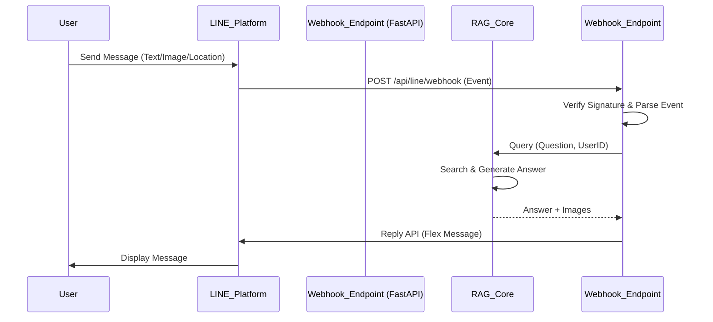

# LINE Integration Plan: AI on LINE (Official Account)

## 1. Overview
ขยายขีดความสามารถของ "น้องน่าน" และ Universal Platform ให้สามารถสนทนาผ่าน **LINE Application** ได้ เพื่อเข้าถึงผู้ใช้งานคนไทยจำนวนมากที่คุ้นเคยกับการใช้ LINE อยู่แล้ว โดยใช้เทคโนโลยี **LINE Messaging API** เชื่อมต่อกับ Backend RAG ของเรา

---

## 2. User User Journey (มุมมองผู้ใช้)
1.  **Add Friend**: ผู้ใช้แอดไลน์ Official Account ของ AI (เช่น "@NanGuide")
2.  **Greeting**: ได้รับข้อความต้อนรับและเมนูแนะนำ (Rich Menu)
3.  **Chat**: พิมพ์ถามคำถามได้เลย เช่น "แนะนำที่เที่ยวหน่อย", "วัดภูมินทร์ปิดกี่โมง"
4.  **Instant Reply**: AI ตอบกลับทันที (Text) พร้อมรูปภาพประกอบ (Image Map / Flex Message)
5.  **Location Sharing**: ถ้าถามทาง AI สามารถส่ง Location Map ให้กดนำทางได้เลย

---

## 3. Technical Implementation (ทางเทคนิค)

### 3.1 Architecture Flow

### 3.2 Required Components

#### 1. LINE Developers Console Setup
- Create **Messaging API Channel**.
- Get `Channel Access Token` (Long-lived).
- Get `Channel Secret`.
- Set Webhook URL: `https://your-domain.com/api/v1/integrations/line/webhook`

#### 2. Backend Modifications (Python/FastAPI)
- **Library**: `line-bot-sdk` (Python)
- **New Router**: `Back-end/api/routers/line_webhook.py`
- **Logic**:
  - `handle_message()`: รับข้อความจาก User
  - `reply_message()`: ส่งคำตอบกลับ
  - **Flex Message Generator**: แปลงคำตอบจาก RAG เป็น Flex Message สวยๆ (มีรูป, มีปุ่มกด)

#### 3. Handling User Identity (Multi-Tenant Support)
- LINE ให้ `userId` (Uxxxxxxxx...) มากับทุก Event
- เราต้องสร้าง Mapping ใน Database:
  - `line_user_id` <--> `internal_session_id`
  - เพื่อรักษา Context การคุย (Memory) ให้ต่อเนื่อง

---

## 4. Feature Checklist

- [ ] **Text Message**: ถาม-ตอบ ข้อความปกติ
- [ ] **Rich Menu**: เมนูลัดด้านล่าง (เช่น "ถามทาง", "แนะนำร้านอาหาร", "ติดต่อเจ้าหน้าที่")
- [ ] **Flex Message**: การแสดงผลคำตอบแบบการ์ดสวยงาม (ดีกว่า Text ล้วนๆ)
- [ ] **Location Message**: รองรับการส่งพิกัด GPS
- [ ] **Audio/Voice**: (Advance) รองรับการส่งไฟล์เสียงไปหา AI

---

## 5. Development Steps

1.  **Install SDK**: `pip install line-bot-sdk`
2.  **Create Endpoint**: สร้าง Route รับ POST Request จาก LINE
3.  **Verify Signature**: ตรวจสอบว่า Request มาจาก LINE จริงๆ (Security)
4.  **Connect RAG**: เชื่อมฟังก์ชัน Chat ให้วิ่งเข้า `rag_orchestrator`
5.  **Test Deployment**: ต้อง Deploy บน Server ที่มี HTTPS (เพราะ LINE Webhook บังคับ HTTPS) หรือใช้ `ngrok` สำหรับเทส Local

---

**Note**: แผนนี้สามารถเริ่มทำได้ทันที โดยใช้ Codebase เดิมที่มีอยู่ เพียงแค่เพิ่ม "Doorway" (ช่องทางเข้า) ใหม่ให้ระบบครับ
