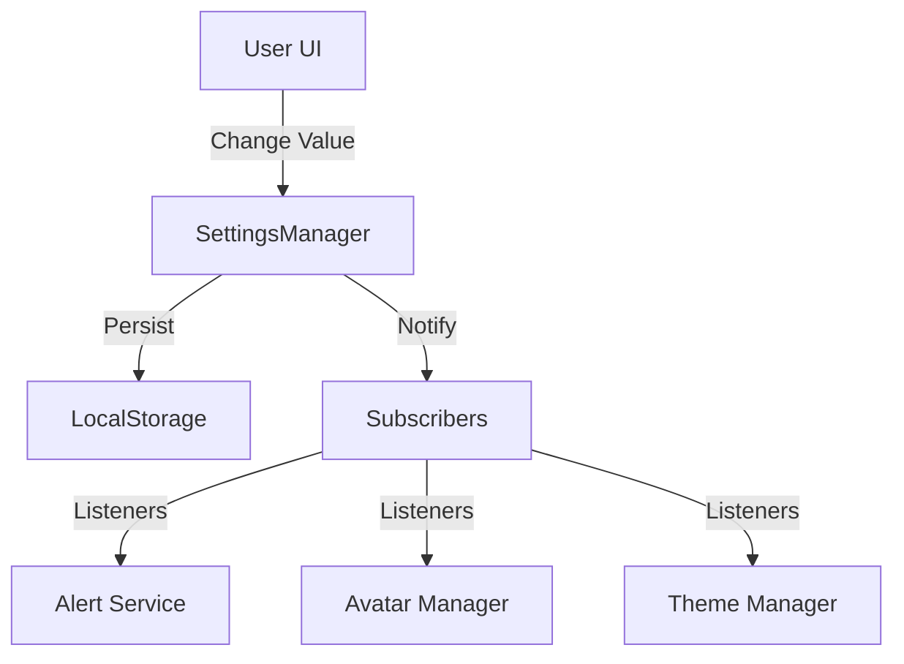

# System Architecture: Scalable Settings System

## 1. Core Philosophy (ปรัชญาหลัก)
ระบบตั้งค่าต้องมีความยืดหยุ่นสูง (Extensible) รองรับการเพิ่มค่าใหม่ๆ ได้ง่ายโดยไม่ต้องรื้อโค้ด UI และต้องมีการจัดการ State ที่ดี (Reactive) เพื่อให้ส่วนต่างๆ ของแอพตอบสนองต่อการเปลี่ยนแปลงทันที

### Design Principles:
1.  **Schema-Driven UI**: หน้า UI ของ Settings ต้องถูกสร้างอัตโนมัติจาก JSON Schema ห้าม Hardcode ปุ่ม Switch หรือ Slider ทีละอัน
2.  **Centralized State**: เก็บค่าทั้งหมดไว้ที่เดียว (`SettingsManager`) และ Persist ลง LocalStorage อัตโนมัติ
3.  **Reactivity**: Module อื่นๆ สามารถ Subscribe เพื่อรอฟังการเปลี่ยนแปลงของค่า Setting เฉพาะตัวได้
4.  **Backward Compatibility**: รองรับการเพิ่ม/ลด Setting ในอนาคตโดยไม่ทำให้ค่าเก่าของผู้ใช้พัง

---

## 2. Architecture Overview



---

## 3. Data Structure (Setting Schema)

เราจะนิยาม "โครงสร้าง" ของการตั้งค่าไว้ในไฟล์ Config แยกต่างหาก เช่น `config/settingsSchema.js`

```javascript
export const settingsSchema = [
    {
        id: 'group_alerts',
        title: '🔔 การแจ้งเตือน (Notifications)',
        items: [
            {
                key: 'alert_watchdog_enabled',
                type: 'toggle',
                label: 'เฝ้าระวังภัยอัตโนมัติ (Watchdog)',
                description: 'แสดง Pop-up แจ้งเตือนเมื่อมีเหตุด่วนระดับสูง (Level 4-5)',
                defaultValue: true
            },
            {
                key: 'alert_tts_enabled',
                type: 'toggle',
                label: 'อ่านเสียงแจ้งเตือน (Text-to-Speech)',
                description: 'ให้น้องน่านอ่านรายละเอียดการแจ้งเตือนให้ฟัง',
                defaultValue: true,
                dependency: 'alert_watchdog_enabled' // โชว์ก็ต่อเมื่อ watchdog เปิดอยู่
            }
        ]
    },
    {
        id: 'group_display',
        title: '🎨 การแสดงผล (Display)',
        items: [
            {
                key: 'theme_mode',
                type: 'select',
                label: 'ธีมของระบบ',
                options: [
                    { value: 'neon', label: 'Neon (Dark)' },
                    { value: 'nongnan', label: 'Nong Nan (Light)' }
                ],
                defaultValue: 'nongnan'
            },
            {
                key: 'ui_font_size',
                type: 'slider',
                label: 'ขนาดตัวอักษร',
                min: 12,
                max: 24,
                defaultValue: 16
            }
        ]
    }
];
```

---

## 4. `SettingsManager` Class Design

```javascript
class SettingsManager {
    constructor() {
        this.settings = {};
        this.subscribers = new Set();
        this.init();
    }

    init() {
        // 1. Load schema defaults
        // 2. Load overrides from LocalStorage
        // 3. Merge values
    }

    get(key) {
        return this.settings[key];
    }

    set(key, value) {
        this.settings[key] = value;
        this.save();
        this.notify(key, value);
    }

    // ฟังการเปลี่ยนแปลงของ key ที่สนใจ
    subscribe(key, callback) {
        // ...
    }
}
```

---

## 5. UI Implementation (Auto-Generator)

เราจะสร้าง `SettingsModal.js` ที่ทำหน้าที่:
1.  Loop ผ่าน `settingsSchema`
2.  สร้าง HTML Element ตาม `type` (Switch, Select, Slider)
3.  Bind Event Listener เข้ากับ `SettingsManager.set()` โดยอัตโนมัติ

**ข้อดี:** ในอนาคตถ้าต้องการเพิ่ม Setting ใหม่ (เช่น "ความเร็วเสียงพูด") **เราแค่ไปเพิ่ม JSON 1 ก้อนใน Schema** หน้า UI และระบบเก็บข้อมูลจะทำงานรองรับทันทีโดยไม่ต้องเขียนโค้ด UI เพิ่ม!

---

## 6. Future Roadmap

1.  **Cloud Sync**: ซิงค์ค่า Setting ข้ามอุปกรณ์ (เมื่อมีระบบ User Login)
2.  **Profiles**: แยกโปรไฟล์การตั้งค่า (เช่น "โหมดทำงาน", "โหมดกลางคืน")
3.  **Reset to Defaults**: ปุ่มคืนค่าเดิมโรงงานแยกรายหมวดหมู่
